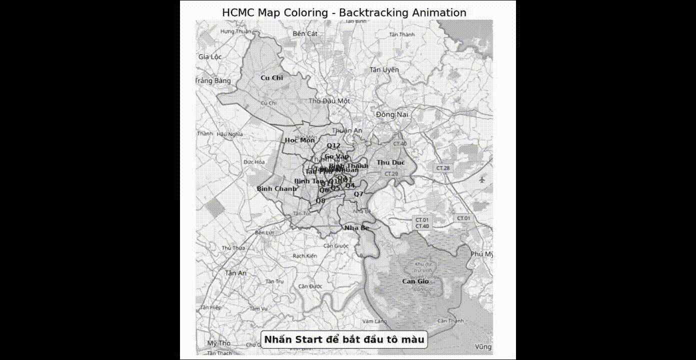

# 🗺️ HCMC Map Coloring Problem (CSP Backtracking Visualization)

## 📌 Giới thiệu

Đây là project mô phỏng bài toán **tô màu bản đồ (Graph Coloring Problem)** áp dụng cho các quận/huyện TP.HCM.

Bài toán được giải bằng thuật toán:

> 🔥 **Backtracking (Constraint Satisfaction Problem - CSP)**

Kết quả được trực quan hóa bằng **Matplotlib animation**, mô phỏng quá trình tô màu từng bước và quay lui khi vi phạm ràng buộc.

---

## 🎯 Mục tiêu bài toán

- Gán màu cho các quận/huyện
- Không cho phép 2 khu vực liền kề có cùng màu
- Sử dụng tối thiểu 4 màu:
  - 🔴 Red
  - 🟢 Green
  - 🔵 Blue
  - 🟡 Yellow

---

## 🧠 Thuật toán sử dụng

### 👉 Graph Coloring Problem (CSP)

Bài toán được mô hình hóa như sau:

- **Biến (Variables):** các quận/huyện
- **Miền giá trị (Domain):** 4 màu
- **Ràng buộc (Constraints):**
  - Hai node kề nhau không được cùng màu

### 👉 Thuật toán giải:
- Backtracking Search
- Heuristic chọn node:
  - Minimum Remaining Values (MRV)

---

## 🏙️ Dữ liệu bản đồ

Bản đồ được mô phỏng gồm các khu vực:

- Quận 1, 3, 4, 5, 6, 7, 10, 11, 12
- Gò Vấp, Tân Bình, Tân Phú
- Bình Thạnh, Bình Tân
- Thủ Đức
- Nhà Bè, Cần Giờ
- Củ Chi, Hóc Môn, Bình Chánh

Quan hệ láng giềng được xây dựng dưới dạng **graph adjacency list**.

---

## 🎬 Demo Animation

